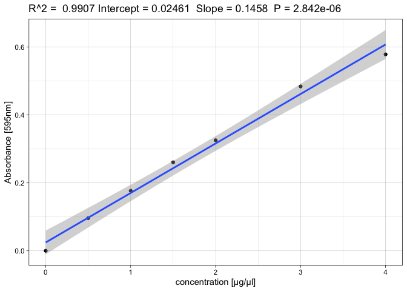

An introduction to bradfoRd
================

## Description

The goal of **bradfoRd** is it to ease determination of protein
concentrations measured by bradford protein assays. Many labs still rely
on cumbersome excel sheets to generate standard curves and perform the
subsequent calculations which, in general, is highly inefficient. This
package implements the all-in-one function `bradford_analysis()` which:

-   subtracts the blank from every measurement
-   supports technical replicates
-   generates a standard curve based on measured protein standards of
    known concentration
-   calculates protein concentrations (mg/ml) based on measured
    absorbance (595nm)
-   saves the standard curve (pdf-file) and calculated concentrations
    (csv-file) to the specified output directory

This package should benefit people who do protein measurements regularly
and do not have access to software that automates this process.

## Installation

You can install the released version of **bradfoRd** from GitHub:

``` r
devtools::install_github("GregorD96/bradfoRd")

library(bradfoRd)
```

## Example

The function `bradford_analysis()` requires a total of 5 arguments:

-   **file** - path to the input xls-file

-   **sheet\_calibration** - sheet containing the protein standards

-   **sheet\_sample** - sheet containing the samples

-   **dil\_fctr** - numeric value specifying the sample dilution (e.g:
    1:10 dilution -&gt; dil\_fctr = 10 )

-   **output\_dir** - directory to which the output table and standard
    curve is saved to as a csv and pdf file, respectively

``` r
bradford_analysis(file = "Bradford_test.xls",
                  sheet_calibration = 4,
                  sheet_sample = 5,
                  dil_fctr = 4, 
                  output_dir = "your/output/dir")
```

As can be seen from the example above `bradford_analysis()` requires the
input to be an xls-file and the values of the protein standards and
samples to be on different sheets of that file. In addition, those
sheets have to follow some formatting guidelines explained next. First
off, both sheets require a header in the first row of each column. The
names of these headers are irrelevant, the order of the columns however
need to be exactly as specified below:

1.  The sheet specified in `sheet_calibration` needs to have 3 columns.

    -   The first column contains an identifier (e.g: sample1…) for each
        sample with the blank being named `blank`

    -   The second column contains the concentration of the protein
        standard in mg/ml

    -   The third column contains the absorbance values determined by
        the bradford protein assay

2.  The sheet specified in `sheet_sample` needs to have 2 columns

    -   The first column contains an identifier (e.g: sample1,) for each
        sample with the blank being named `blank`

    -   The second column contains the absorbance values determined by
        the bradford protein assay

As an example look at the following tibbles generated from
`sheet_calibration` and `sheet_sample` of the Bradford\_test.xls:

    ## # A tibble: 5 x 3
    ##   names concentration absorbance_series
    ##   <chr>         <dbl>             <dbl>
    ## 1 blank           0               0.371
    ## 2 blank           0               0.370
    ## 3 blank           0               0.375
    ## 4 A               0.5             0.467
    ## 5 A               0.5             0.473

    ## # A tibble: 5 x 2
    ##   names   absorbance_sample
    ##   <chr>               <dbl>
    ## 1 blank               0.327
    ## 2 sample1             0.499
    ## 3 sample2             0.493
    ## 4 sample3             0.464
    ## 5 sample4             0.590

## Results

The output generated by `bradford_analysis()` on a test file can be seen
below:

<!-- -->

    ## # A tibble: 8 x 3
    ##   names   absorbance_sample concentration_mg_per_ml
    ##   <chr>               <dbl>                   <dbl>
    ## 1 sample1             0.172                    4.04
    ## 2 sample2             0.166                    3.89
    ## 3 sample3             0.137                    3.09
    ## 4 sample4             0.264                    6.56
    ## 5 sample5             0.155                    3.58
    ## 6 sample6             0.284                    7.13
    ## 7 sample7             0.221                    5.39
    ## 8 sample8             0.186                    4.43

## Author

*Gregor Diensthuber, 2021-05-04*

------------------------------------------------------------------------
